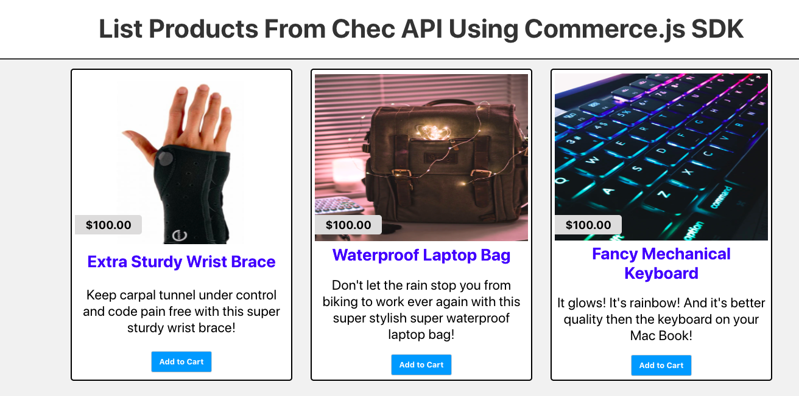

# List Products With The Commerce.js SDK

## Table Of Contents

  - [Description](#description)
  - [Stack](#stack)
  - [Final Product](#final-product)
  - [Getting started](#getting-started)
  - [Dependencies](#dependencies)
  - [Contributions and Docs](#contributions-and-docs)

## Description

This is a mini project that can be used as an example of how to list products from the Chec API on your website using the Commerce.js SDK

## Stack

- [React.js / create-react-app](https://reactjs.org/docs/create-a-new-react-app.html)
- Javascript
- [dotenv](https://www.npmjs.com/package/dotenv)
- CSS
- HTML

## Final Product



## Getting started

1. Clone this repository
2. Install dependencies using `npm install`
3. Create a .env file in the project root directory
4. In the .env file

```
REACT_APP_API_KEY="chec_api_public_key"
```

If you do not yet have a Chec API key you can sign up and get one [here](https://dashboard.chec.io/signup). Make sure to add products with name, price, description and images.

5. Run command `npm start` in the terminal to start the react server
6. The app will be served at <http://localhost:3000/>
7. Click the "add products" button to see all your products.

## Dependencies

    @chec/commerce.js: ^2.0.1,
    @testing-library/jest-dom: ^4.2.4,
    @testing-library/react: ^9.3.2,
    @testing-library/user-event: ^7.1.2,
    axios: ^0.19.2,
    dotenv: ^8.2.0,
    react: ^16.13.0,
    react-dom: ^16.13.0,
    react-scripts: 3.4.0

## Contributions and Docs

This project was built by

https://github.com/curriecode

Docs

- [Chec](https://github.com/chec)
- [Commerce.js](https://github.com/chec/commerce.js)
